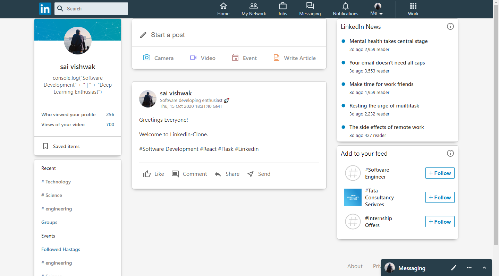

# Linkedin-Clone

React Linkedin clone with Realtime posts and sentiment Analysis

# Introduction

Linkedin Clone Application is developed with real-time database using MongoDB, Font-End with React, Back-End with Python-Flask, Realtime-Connection - Pusher. The ML model is trained on Stanford Movie Review datasets so results might vary sometimes.

# Requirements

- Node 🤖
- Python 🔥
- Browser 😃

# Installation

    git clone https://github.com/saivishwak/Linkedin-Clone

    cd Linkedin-Clone

    npm install

    npm start

# Things to do before npm start
- Add your firebase config in src/firebase.js
- Add your backend server url in src/axios.js
- Add your pusher config in src/components/body.js
- Add your mongoDB config in Backend/mongo.py
- Add your pusher-python config in Backedn/server.py
- pip install requirements with Backend/requirements.txt
- Initially create a linkedin_posts database in MongoDB

## [MIT License](https://raw.githubusercontent.com/saivishwak/Linkedin-Clone/master/LICENSE)

<h4>You can use it absolutely anywhere!</h4>

Feel free to make a pull request!
